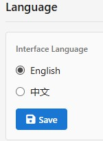
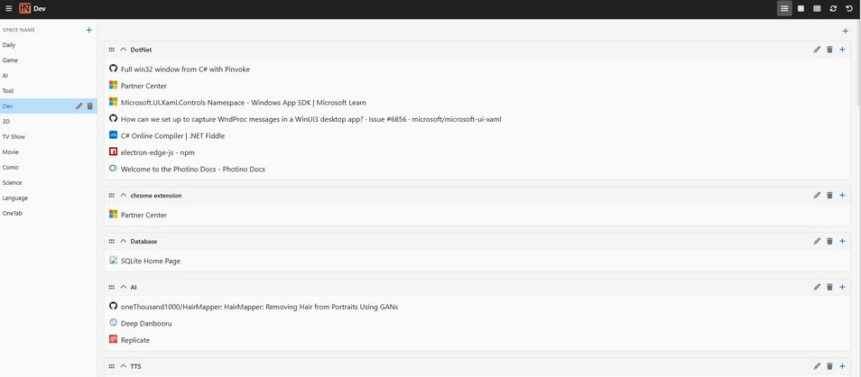
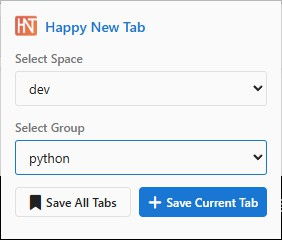
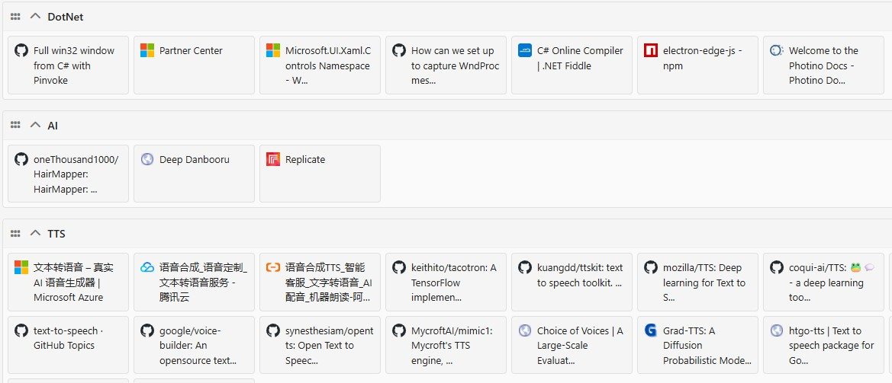
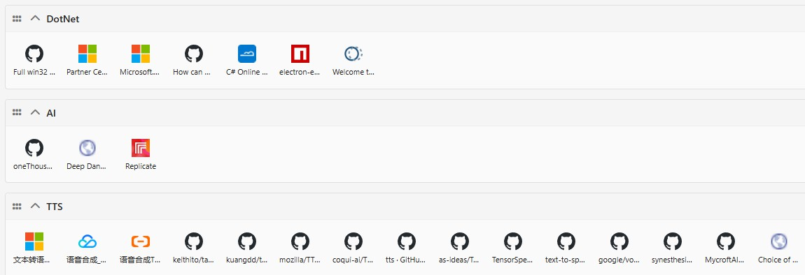
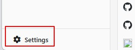
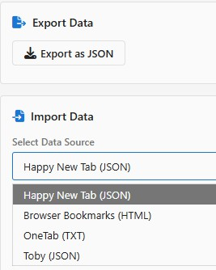
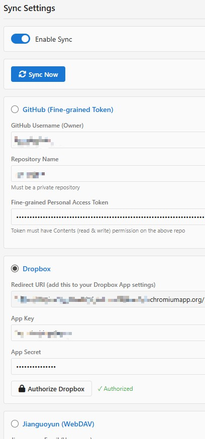

# Happy New Tab
A Chrome extension for your New Tab page. Similar to Toby, more convenient than OneTab, and completely free.

#### Language
[中文](README.md)

#### Address
[Chrome Store](https://chromewebstore.google.com/detail/happy-new-tab/aaajpdaafihabgojiadheffbhecfhgif)

# Features
* **Completely Free**: No limits on the number of categories, tabs, or features.
* **Easy Migration**: Import data from Toby, OneTab, or browser bookmarks without starting from scratch.
* **Tab Collection**: Organize tabs into two-level groups. The first level is the Category (left sidebar), and the second level is the Tab Group (right content page).
* **Drag-and-Drop**: Categories, groups, and tabs can all be reordered by dragging.
* **Cross-Group Moving**: Tabs can be dragged to other groups within the same category.
* **Display Modes**: Choose between List, Card, or Icon views.
* **Local Storage**: All data is saved locally in browser with no quantity limit.
* **Cloud Sync**: Sync to a GitHub private repo, Dropbox, or Nutstore (Jianguoyun) via settings.
* **Mobile**: Adaptive width, compatible with mobile browsers.
* **Bilingual**: Supports both English and Chinese.  

# Screenshots

# Instructions
## Collecting Tabs

* Click the extension icon on a page to open the popup and select the target Category and Group.
* You can add all open tabs at once.
* New groups are automatically named by time and can be renamed later.

## Drag-and-Drop
* Tabs, groups, and categories are all draggable.
* To move a tab to another group, drag it onto the **title** of the target group before releasing.

## Display Mode
At upper right corner of New Tab, you can choose from 3 display modes: List, Card and Icon.  
#### Card

#### ICON

## Setting
There is a setting button at bottom left.  

### Import & Export

#### Export
In the "Import/Export" tab of the Options page, click Export. All data will be exported as a JSON file named by the date.

#### Import
* Go to the "Import/Export" tab in Options and select the data source.
* **Browser Bookmarks**: Must be in HTML format.
* **Toby**: Only JSON files exported from Toby are accepted.
* **OneTab**: Copy the exported text and paste it into a new `.txt` file.
* Select the corresponding file to import.

**Note:**
* Importing data exported from **this extension** will overwrite existing data.
* Importing from **other sources** will create new categories for the imported data.
* OneTab data is stored under a single new category.
* Toby data will create new categories for each Toby category to maintain a similar experience.

### Sync

The Options page includes "Sync Settings" and a "Sync Tutorial".
* Follow the tutorial step-by-step for setup.
* You can configure multiple sync methods, but only **one** can be active at a time for simplicity and speed.
* Test the connection using the sync button in top right of Sync Settings page.
* A sync button is also available at top right of the extension's main page.
* **Manual Sync**: The extension does not sync automatically; please click sync button manually.
* **Sync Logic**: A simple "newer data overwrites older data" rule.

### Syncing Across Devices
If you already have synced data stored remotely and want to install the extension on another browser and get that data, please do not modify any data on extension’s main page in the new browser. 

Instead, go directly to Option page, fill in your sync information, and perform a synchronization immediately.

# Future Updates
Since this extension was almost entirely created by AI, I don't want to read through the AI-written code. Therefore, I will **not** be adding any new features and will only provide bug fixes.

# Notes for Other Developers
The extension icons use **Font Awesome**, not Google Fonts.
The AI was asked to use Google Fonts, but it claimed that due to network issue, it switched to Font Awesome while retaining Google Font filename.

# ChangeLog
### v1.1.0
* After opening the popup page, if the current tab already exists in the group selected on the popup, a "Remove Tab" button will be displayed, allowing the page to be removed from that group.