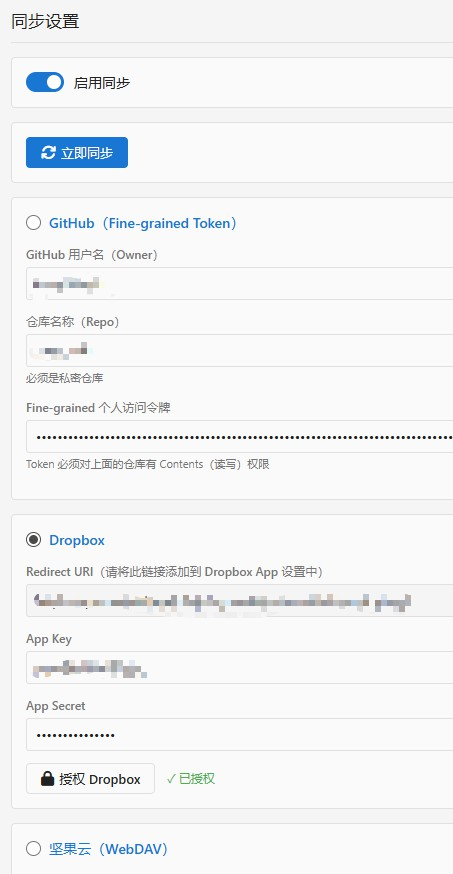

# Happy New Tab
新标签页Chrome扩展，和Toby类似，比Onetab方便好用，而且完全免费。  

#### Language
[English](README.en.md)

#### 地址
[Chrome商店](https://chromewebstore.google.com/detail/happy-new-tab/aaajpdaafihabgojiadheffbhecfhgif)

# 功能
* 完全免费，没有任何分类数量、标签数量或功能上的限制
* 可以从Toby, Onetab, 浏览器收藏夹导入数据，而无须从头开始。
* 收集标签页，可以对标签页进行二级分组。第一层是分类，显示在左边侧边栏；第二层是标签分组，显示在右侧内容页。
* 分类、分组、标签，均可以拖拽排序
* 标签也可以可以拖拽到同一个分类下的其他分组。
* 标签页有3种呈现方式，列表方式、卡片方式，图标方式，自由选择
* 所有数据保存在本地浏览器内，没有数量上限。
* 选项中，可以通过设置，同步到Github私有项目，Dropbox或坚果云，自行设置即可，完全免费
* 自适应宽度，手机浏览器可用
* 支持中英文  

# 截图

# 使用说明
## 收集标签页

* 在想要收集的标签页，点击本扩展图标，打开popup对话框，选择这个标签想要添加到的分类、分组即可。
* 可以一次添加所有打开的标签页。
* 可以添加到新分组。新分组用时间自动命名，之后可以自己改名。

## 拖拽
* 标签、分组、分类，都可以拖拽。
* 如果要把一个标签，拖到另一个分组时，需要拖到目标分组的标题上，再松手。

## 显示模式
新标签页右上角，有3种显示模式切换：列表，卡片，图标。  
#### 卡片

#### 图标

## 选项设置
新标签页左下角有设置按钮

### 导入导出

#### 导出
选项设置页面，导入导出分页，点击导出。扩展的所有数据，会导出为json文件，自动以日期命名。

#### 导入
* 选项设置页面，导入导出分页，选择数据来源。
* 浏览器收藏夹，必须是html
* Toby支持多种格式导出。本扩展只接受Toby导出的json格式的文件
* OneTab数据，导出时是一段文本，自行复制粘贴到一个新的txt文件中
* 选择对应文件，导入即可。

**注意：**
* 导入从本扩展导出的数据时，是覆盖导入。
* 导入其他来源的数据时，是创建新的分类，来存放导入的数据。
* OneTab的数据，全部存放在一个新分类下。
* Toby和本扩展一样，是2层的分类，所以每个Toby数据中的分类，都会创建一个新分类，这样数据导入后，体验和Toby类似。

### 同步

扩展的选项页面，有2个同步相关的页面：同步设置 和 设置教程。  

对着同步设置教程，一步步做，就能设置成功。  

需要注意的是，你可以一次设置好所有同步方式，但是，为了简化同步流程，加快同步速度，每次只能选择一个方式同步。

设置好之后，可以在选项页面的同步设置分页，点击右上角的同步按钮，测试同步。

在扩展的主页，右上角也有同步按钮。

扩展不会自动同步，请在需要的时候，手动点击同步按钮同步。

同步逻辑，是简单的用时间较新的数据，覆盖时间较旧的数据。

### 不同设备同步
如果你已经在远程有同步数据，现在想在另一个浏览器上也安装扩展，并把数据同步过去，那么在这个目标浏览器上，请不要调整扩展主页的数据。你应该直接去选项设置中，填写同步信息，并立刻进行同步。

# 后续更新
由于本扩展几乎完全由AI制作，不是很想去读一遍AI写的代码，所以将拒绝添加任何新功能，只修bug。

# 其他开发者的注意事项
本扩展的图标，使用的是Font Awesome，不是Goolge font。

只不过，我要求AI用Google Font，但AI声称由于网络问题，它自动更换到了Font Awesome，并沿用了Google Font的文件名。

# ChangeLog

